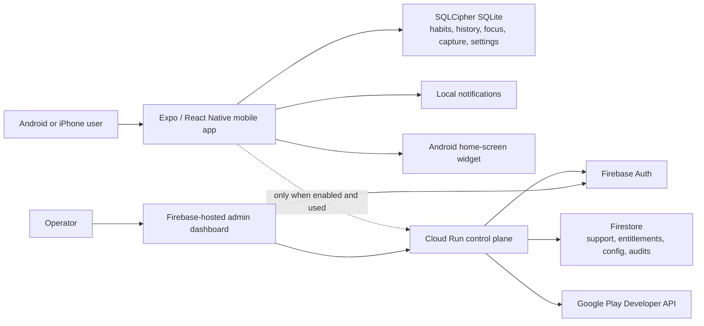

# Spark

**A dopamine-aware, no-guilt habit and focus tracker designed for ADHD brains.**

Spark is an Android-first Expo/React Native application that also targets iPhone. Its core
experience is offline-first: habits, routines, completions, focus sessions, rewards, capacity
check-ins, and captured thoughts stay on the device in encrypted SQLite. No account or server is
required.

Google Cloud is optional. It exists only for consented support conversations, remote configuration,
verified store purchases, entitlement grants, and a small admin dashboard. Spark does not upload
habit history to the cloud.

If you are new to mobile development, begin with [START-HERE.md](./START-HERE.md). When you need
another topic, use the purpose-based [documentation home](./docs/README.md); you do not need to
read this long repository reference from top to bottom.

On Windows, run `.\spark.cmd` for a guided command catalog. It wraps setup, Expo targets, Android
tools, tests, builds, validation, and optional local services; each command supports `-Help`.

## Current status

Spark is a substantial implementation, not only a design document. It includes the mobile app,
shared domain logic, tests, an optional Cloud Run API, a static admin dashboard, Firebase rules and
indexes, Terraform, and release documentation.

| Target | Current position |
| --- | --- |
| Quick local UI preview | Available through Expo Go, with native-feature limitations |
| Android development build | Implemented; requires Android Studio/emulator or a USB device |
| Offline Android internal test | Code-ready; requires final identity, policy details, and native-device QA |
| Public free Android release | Requires the release gates below |
| Public paid Android release | Server safeguards are implemented; requires deployment and Play lifecycle testing |
| iPhone release | Codebase-compatible, but native build, StoreKit, widget, and device QA remain |
| Google Cloud deployment | Optional and defined, but not deployed by this repository |

Validation snapshot on **2026-07-17**:

- workspace TypeScript checks passed;
- 238 automated tests passed: 171 mobile, 26 domain, 25 API, and 16 admin;
- coverage gates passed across mobile `app/` and `src/`, the domain package, core API application,
  and admin source;
- admin, domain, API, shared contracts, and Android JavaScript export builds passed;
- Expo Doctor passed 20/20 checks;
- the release checker correctly blocks publication while privacy placeholders remain;
- the production dependency audit has the known moderate transitive advisory described below;
- Android Studio's JBR and `adb` device selection are supported by `spark.cmd`; a full signed
  release build, Maestro run, and representative-device matrix remain manual release checks;
- Terraform was formatted and validated with a temporary checksum-verified official binary; no
  project-specific plan or apply was run.

The detailed engineering and experience assessment is in
[Spark quality and release-readiness review](./docs/quality-review.md). The short verdict is:

- the offline product foundation is strong;
- an Android internal or closed free beta should come before cloud monetization;
- support, purchase ownership, RTDN reconciliation, and API kill switches are implemented;
- the single device-level Maestro flow must still be run on actual Android hardware or an emulator.

The authoritative, detailed inventory of every implemented product feature, ADHD-support strategy,
local/cloud data boundary, monetization choice, and remaining native-QA caveat is
[the Spark feature catalog](./docs/11-feature-catalog.md).

## Product principles

- **Tiny counts.** Every habit can have tiny, default, and stretch versions.
- **Flexible consistency.** Rolling progress is always available; each habit can also opt into a
  reward-first daily or every-other-day Momentum streak with neutral pauses, delays, and earned
  Flex passes instead of an all-or-nothing reset.
- **Capacity before ambition.** The app asks what is realistic now.
- **Low friction.** Today presents a short, actionable set rather than an overwhelming backlog.
- **Immediate, non-exploitative reward.** Completions use color, haptics, motion, and fixed progress
  rewards. Spark does not use casino-style randomized payouts.
- **No shame.** Missed days are not shown as moral failures.
- **Private by default.** Core data remains local and an account is optional.
- **Accessible and sensory-aware.** Reduced motion, high contrast, larger text, haptic controls,
  dark mode, labels, and touch targets are built into the design.
- **Easy to leave.** Users can export JSON, password-encrypted backup, or portable CSV files and
  restore validated backups later.

Spark is a wellness and productivity tool. It does not diagnose, treat, or replace professional
care for ADHD or any other condition.

## Implemented features

### Offline mobile features

- guided onboarding and starter data;
- Today recommendations based on schedule, capacity, available time, context, and recent activity;
- compact remembered check-ins, Same as yesterday, time-of-day context memory, Pick for me,
  a one-action Rescue my day mode, quiet return cards, and neutral deferrals;
- Simple mode, contextual Help me now, a no-grade weekly reset, tomorrow context/tiny planning,
  and a per-habit friction toolkit;
- tiny, default, and stretch habit variants;
- daily, weekday, weekly-frequency, interval, and flexible schedules;
- interval-aware habit pause history, archive, detailed history/correction, completion tags,
  exact or windowed reminder scheduling, preview, and editing;
- guarded completion taps, accessible undo, tactile completion celebration, and deterministic
  Spark rewards;
- no-reset rolling rhythms, optional reward-first Momentum streaks, recovery language, and
  comeback recognition;
- quick brain-dump capture with drafts, search, edit, delete/undo, release/restore, multi-select,
  Android Share to Spark, a quick-capture widget, and habit/focus/routine conversion;
- restart-safe focus/body-double timer with parked interruptions, prefilled two-minute launches,
  optional launch countdown, local offline soundscapes, transition capture, companions, and
  planned-versus-actual feedback;
- explicit focus/departure calendar export without calendar reads, Departure mode with a real
  buffer, and a Focus home-screen widget with pause/resume controls;
- editable/template-based routines with reorder, duplicate, archive/restore, skip, tiny mode,
  pause/resume after restart, finish estimates, and habit/focus links;
- Journey summaries, weekly reflection, per-habit calendars, locally derived/hideable supportive
  observations, and materialized long-term progress views;
- configurable theme, high contrast, text scale, reduced motion, and haptics;
- a one-action sensory Quiet now switch, optional device-authentication app lock, sensitive
  app-preview protection, and notification lock-screen privacy;
- occurrence-aware local notifications with windows, configurable snooze, Quiet today, preview,
  caps, and optional ignored-reminder quieting;
- encrypted local SQLite in native builds;
- validated/versioned JSON backup, every-version migrations, bounded migration/restore safety
  copies, integrity reporting, restore, and portable CSV export;
- password/recovery-code encrypted backups and bounded automatic backups to one user-selected
  Android folder;
- deliberate selected-win image/text sharing and neutral one-week personal experiments;
- five zero-cloud-cost Android widgets: explicit-confirmation Today, Quick Capture, reliable
  Focus controls, Progress, and a four-action Toolkit, plus four safe launcher shortcuts;
- collapsible Settings/Progress sections, width-safe add controls, history-aware Back fallbacks,
  and eleven skippable, dismissible, fully replayable feature tutorials;
- bundled language selection for 15 languages, including Lithuanian, with English fallback;
- privacy-safe content-redacted diagnostics and an Android startup Baseline Profile;
- privacy policy and data-boundary screens;
- premium supporter themes, badge control, companions, celebration styles, offline soundscapes,
  and icon treatments.

### Optional cloud features

- anonymous Firebase identity created only when a cloud feature is used;
- asynchronous private support threads;
- remote global feature configuration and announcement;
- Google Play verification, acknowledgement, hashed atomic ownership, idempotent restore, pending
  handling, authenticated RTDN reconciliation, and voided-purchase revocation;
- manual premium grants and revocations with audit reasons;
- official Google Play promo-code inventory;
- role-based admin access;
- deny-all Firestore client rules;
- API-side feature shutdowns, structured request logs, retention jobs, bounded requests, rate
  limits, and conservative Cloud Run scaling.

### Admin dashboard

- overview counts;
- support inbox and replies;
- cursor-paginated support, cloud-user, exact email/UID, and entitlement lookup;
- premium grant/revoke controls;
- configuration editing;
- promo-code import and assignment;
- owner-only filtered audit viewer;
- `support`, `content`, and `owner` roles.

Most Spark users never appear in the dashboard. An offline installation has no cloud identity and
cannot be reviewed, messaged, or remotely granted access. That is an intentional privacy boundary.

## Architecture



Important boundaries:

- the mobile app is useful when every cloud environment variable is blank;
- habit content and completion history do not go to Cloud Run or Firestore;
- the static dashboard never talks directly to Firestore for privileged data;
- all useful dashboard operations require Firebase authentication and server role checks;
- the Cloud Run URL is internet-reachable by design, but protected routes require valid tokens;
- Firebase web/API keys are public project configuration, not service-account secrets;
- service-account JSON keys are not needed and should not be created for Cloud Run.

More detail: [architecture.md](./docs/architecture.md).

## Data inventory

| Data | Stored where | Cloud required | Visible to an admin |
| --- | --- | --- | --- |
| Habits, variants, and optional Momentum settings/protections | encrypted device database | No | No |
| Completions, rolling rhythms, and Momentum calculations | encrypted device database | No | No |
| Focus sessions and parked thoughts | encrypted device database | No | No |
| Routines and quick capture | encrypted device database | No | No |
| Capacity and accessibility settings | encrypted device database | No | No |
| Weekly plans, departure plans, and personal experiments | encrypted device database | No | No |
| Local notification schedule | device operating system | No | No |
| JSON or encrypted backup | location chosen by the user | No | No |
| Generated backup recovery code | device secure storage | No | No |
| Selected progress-card image | temporary device cache until system sharing finishes | No | No |
| Calendar event draft | system calendar UI only after an explicit tap | No | No |
| Anonymous Firebase UID | Firebase Auth/Firestore after cloud use | Yes | Yes |
| Support messages | Firestore | Yes | Authorized support/admin only |
| App version/platform/last cloud use | Firestore | Yes | Authorized admin only |
| Premium entitlement | Firestore and local cache | Yes for remote verification/grant | Authorized admin |
| Purchase token | sent to API, then represented only by SHA-256 hash | Yes | Raw value is not stored or logged |
| Admin role and audit reason | Firebase claims/Firestore | Yes | Owner/admin as authorized |

The privacy policy template is [docs/privacy-policy.md](./docs/privacy-policy.md). Replace every
placeholder and publish it before any external release.

## What it costs

### Initial offline release

The mobile app has **no required monthly server cost**. You can develop and distribute an offline
Android build with:

- local Android builds: no per-build cloud charge;
- optional EAS builds: subject to the current Expo plan and build quota;
- Google Play Console: the developer account you already have;
- no Firebase, Cloud Run, Firestore, Hosting, domain, SMS, or AI API requirement.

### Optional Google Cloud estimate

At small test scale, the intended infrastructure will often remain inside no-cost quotas, but this
is not a guarantee:

| Component | Conservative starting shape | Current no-cost allowance to verify |
| --- | --- | --- |
| Cloud Run | request-based, `min=0`, `max=2`, 512 MiB | 2 million requests/month, 180,000 vCPU-seconds, 360,000 GiB-seconds in eligible regions |
| Firestore | one regional default database, bounded reads | 1 GiB storage; 50,000 reads/day; 20,000 writes/day; 20,000 deletes/day; 10 GiB outbound/month |
| Firebase Hosting | static admin and privacy page | 10 GB storage and 10 GB/month transfer |
| Firebase Auth | anonymous mobile and Google admin sign-in | no phone/SMS authentication is used |
| Artifact Registry/Cloud Build | occasional API images | usage and retained images can create small charges |
| Budget alerts | Terraform default USD 5/month | alerts notify; they do not stop spending |

Practical planning ranges:

- offline app only: **USD 0/month cloud runtime**;
- deployed but idle/light testing: commonly **USD 0–5/month**;
- modest support and purchase traffic: plan **USD 0–10/month**, then measure;
- store fees, taxes, refunds, a custom domain, and developer-program fees are separate.

The Warsaw Cloud Run region (`europe-central2`) is eligible for the Cloud Run request-based free
tier at the time of this review. Firestore permits exactly one free database per project. Pricing
and credit eligibility can change, so verify the official pages before deployment:

- [Cloud Run pricing](https://cloud.google.com/run/pricing)
- [Firestore pricing and free quota](https://firebase.google.com/docs/firestore/pricing)
- [Firebase Hosting quotas](https://firebase.google.com/docs/hosting/usage-quotas-pricing)
- [Firebase pricing plans](https://firebase.google.com/docs/projects/billing/firebase-pricing-plans)
- [Cloud Billing budgets](https://cloud.google.com/billing/docs/how-to/budgets)

Read [cost controls](./docs/08-cost-controls.md) before linking billing. Google Cloud credits may
cover eligible usage, but their scope and expiration depend on the credit program.

## Repository map

```text
Spark/
├─ apps/
│  ├─ mobile/                  Expo/React Native Android and iOS app
│  └─ admin/                   Vite/React static admin dashboard
├─ packages/
│  ├─ domain/                  Scheduling, recommendation, rhythm, reward logic
│  └─ cloud-contracts/         Shared API request/response schemas
├─ services/
│  └─ control-plane/           Express API for support, config, roles, and purchases
├─ infra/
│  └─ terraform/               Google Cloud/Firebase infrastructure
├─ docs/                       Product, setup, operations, security, and release guides
├─ apps/admin/public/          Firebase-hosted privacy page and static assets
├─ scripts/                    Environment doctor, cleanup, and release checks
├─ firestore.rules             Deny-all client data rules
├─ firestore.indexes.json      Required Firestore indexes
├─ firebase.json               Hosting, rules, and indexes deployment config
└─ cloudbuild.yaml             Control-plane container build
```

## Prerequisites

For JavaScript work and Expo Go:

- Windows 10/11, macOS, or Linux;
- Node.js 22, 23, or 24; Node 24 LTS is recommended;
- npm, included with Node;
- Git;
- an Android or iPhone with Expo Go for the limited UI preview.

For a local Android native build:

- Android Studio;
- Android SDK Platform, Build-Tools, Platform-Tools, Emulator, and command-line tools;
- Android Studio’s bundled Java runtime or another compatible JDK;
- a running Google Play-enabled emulator or USB-debuggable Android device.

For optional cloud deployment:

- a Google Cloud project and billing account;
- Google Cloud CLI;
- Terraform;
- Firebase CLI, which can be run through `npx`;
- access to the Google Play Console application for purchase testing.

For iPhone release:

- Apple Developer Program membership;
- macOS and Xcode for local simulator/archive work, or EAS Build for cloud compilation;
- App Store Connect setup.

Detailed Windows instructions: [docs/01-windows-setup.md](./docs/01-windows-setup.md).

## First setup on Windows

Open PowerShell in the repository root:

```powershell
npm.cmd install
npm.cmd run doctor
npm.cmd run typecheck
npm.cmd run test:ci
```

Use `npm.cmd` and `npx.cmd` when PowerShell blocks `npm.ps1` or `npx.ps1`. You do not need to change
the machine execution policy.

`npm install` runs at the monorepo root and installs every workspace. Commit
`package-lock.json`; do not run separate installs inside each app.

## Fastest app preview

```powershell
.\spark.cmd start -Target ExpoGo
```

This explicitly generates an Expo Go QR code. The default `.\spark.cmd start` command instead
generates a development-build QR code; it opens the installed Spark app and will not open in Expo
Go.

Expo Go is only a quick layout and interaction preview. It does **not** contain Spark’s custom
SQLCipher, Android widget, or Play Billing native code, so it is not an accurate security,
purchase, widget, or release test. Use a development build for normal development.

Official background:
[Expo development builds](https://docs.expo.dev/develop/development-builds/introduction/).

## Recommended Android development loop

1. Install Android Studio and start an emulator, or connect a phone with USB debugging.
2. Confirm the device:

   ```powershell
   adb devices
   ```

3. Build, install, and start the native development client:

   ```powershell
   .\spark.cmd android -Select
   ```

4. On later sessions, keep the installed client and start Metro:

   ```powershell
   Set-Location apps/mobile
   npx.cmd expo start --dev-client
   Set-Location ..\..
   ```

The first native build downloads Gradle and Maven dependencies and can take several minutes.

### Add the Android widgets and shortcuts

After a native build is installed:

1. long-press an empty area of the Android home screen;
2. choose **Widgets**;
3. find **Spark Today**, **Spark Quick Capture**, **Spark Focus**, **Spark Progress**, or
   **Spark Toolkit**;
4. drag the desired widget to the home screen;
5. confirm Today requires explicit logging, Quick Capture opens the minimal form, Focus reflects
   the persisted timer and opens pause/resume actions, Progress opens the local history, and
   Toolkit opens its four labeled destinations.

These widgets use only local snapshots and static deep links, so their runtime cloud cost is $0
regardless of user count. Adding or changing widget definitions requires rebuilding/reinstalling
the native app; Expo Go cannot install them.

Long-press the Spark launcher icon to test **Quick capture**, **2-minute focus**,
**Rescue my day**, and **Resume routine**.

Widget layout, refresh timing, and shortcut presentation vary by launcher, so test Pixel and
Samsung launchers manually.

## Environment configuration

Spark intentionally has no mandatory environment variables for offline use.

### Important loading rule

Each tool loads configuration from its own project directory:

- Expo mobile: `apps/mobile/.env.local`;
- Vite admin: `apps/admin/.env.local`;
- control-plane local process: `services/control-plane/.env`;
- Cloud Run: service environment variables managed by Terraform.

The root [.env.example](./.env.example) is a consolidated reference. Copy the scoped template for
the component you are running.

### Mobile

```powershell
Copy-Item apps/mobile/.env.example apps/mobile/.env.local
```

| Variable | Required | Meaning |
| --- | --- | --- |
| `EXPO_OWNER` | EAS only | Expo account or organization owner |
| `EXPO_PROJECT_ID` | EAS only | EAS project UUID |
| `EXPO_PUBLIC_SPARK_API_URL` | Cloud features only | Deployed Cloud Run base URL |
| `EXPO_PUBLIC_SPARK_REMOTE_CONFIG_ENABLED` | Cloud features only | Explicitly permits once-daily config requests; defaults to `false` |
| `EXPO_PUBLIC_FIREBASE_API_KEY` | Cloud features only | Firebase web API key |
| `EXPO_PUBLIC_FIREBASE_AUTH_DOMAIN` | Cloud features only | Firebase auth domain |
| `EXPO_PUBLIC_FIREBASE_PROJECT_ID` | Cloud features only | Firebase project ID |
| `EXPO_PUBLIC_FIREBASE_APP_ID` | Cloud features only | Firebase app ID |
| `EXPO_PUBLIC_FIREBASE_MESSAGING_SENDER_ID` | Cloud features only | Firebase sender ID |

Every `EXPO_PUBLIC_*` value is embedded in the compiled app and readable by users. Put no secret,
service-account key, Play credential, private API token, or Terraform state in this file.

Restart Metro after changing environment values:

```powershell
Set-Location apps/mobile
npx.cmd expo start --dev-client --clear
Set-Location ..\..
```

For EAS builds, configure the same values in an EAS environment and explicitly associate build
profiles with development, preview, or production as the project matures. Never rely on an
uncommitted local file being available to a cloud build.

Official reference:
[EAS environment variables](https://docs.expo.dev/eas/environment-variables/usage/).

### Admin

```powershell
Copy-Item apps/admin/.env.example apps/admin/.env.local
```

| Variable | Required |
| --- | --- |
| `VITE_SPARK_ADMIN_ENABLED` | Explicit dashboard opt-in; defaults to `false` |
| `VITE_FIREBASE_API_KEY` | Production only; local emulator supplies a safe demo value |
| `VITE_FIREBASE_AUTH_DOMAIN` | Production only |
| `VITE_FIREBASE_PROJECT_ID` | Production only |
| `VITE_FIREBASE_APP_ID` | Production only |
| `VITE_SPARK_API_URL` | Yes |
| `VITE_USE_FIREBASE_EMULATORS` | Set `true` for the localhost demo project |

Like Expo public variables, `VITE_*` values are compiled into static browser code and must not be
secrets.

### Control-plane API and zero-cost local cloud

The API automatically loads `services/control-plane/.env`. For safe local cloud development:

```powershell
Copy-Item services/control-plane/.env.example services/control-plane/.env
Copy-Item apps/admin/.env.example apps/admin/.env.local
```

Then use three terminals:

```powershell
npm.cmd run emulators
npm.cmd run emulators:seed
npm.cmd run api
npm.cmd run admin
```

Run the seed after the emulators report that Auth and Firestore are ready. Open
[http://localhost:5173](http://localhost:5173) and sign in with
`owner@spark.local` / `SparkLocalOnly123!`. The seeder refuses non-`demo-*` projects and
non-localhost endpoints, so this workflow cannot write to production. Java is required for the
Firestore emulator.

Cloud Run receives the same variables through Terraform; do not bake them into the container.

## Command reference

Run these from the repository root unless stated otherwise.

| Command | Purpose |
| --- | --- |
| `npm.cmd install` | Install all workspaces from the lockfile |
| `npm.cmd run doctor` | Check Node, npm, dependencies, and optional Android tools |
| `npm.cmd run start` | Start Expo/Metro for the mobile app |
| `npm.cmd run android` | Generate/build/install the Android native development client |
| `npm.cmd run ios` | Run iOS locally; requires macOS and Xcode |
| `npm.cmd run admin` | Start the Vite admin dashboard at localhost |
| `npm.cmd run api` | Start the control-plane API in watch mode |
| `npm.cmd run emulators` | Start local Auth, Firestore, Hosting, and emulator UI |
| `npm.cmd run emulators:seed` | Create deterministic local owner, config, support, promo, and audit data |
| `npm.cmd run typecheck` | Type-check all workspaces |
| `npm.cmd run test:ci` | Run all unit/component/API tests once |
| `npm.cmd run test` | Run workspace test watchers |
| `npm.cmd run e2e:android` | Run the Maestro offline flow on an installed Android build |
| `npm.cmd run build` | Build packages, API/admin, and export the Android JS bundle |
| `npm.cmd run release:check` | Verify required release files and print manual gates |
| `npm.cmd run clean` | Remove generated build/cache output managed by the cleanup script |

Useful workspace-specific commands:

```powershell
npm.cmd run test:ci --workspace @spark/domain
npm.cmd run test:ci --workspace @spark/mobile
npm.cmd run test:ci --workspace @spark/control-plane
npm.cmd run test:ci --workspace @spark/admin
npm.cmd run build --workspace @spark/admin
npm.cmd run build --workspace @spark/control-plane
```

`npm.cmd run build` does **not** create an APK or AAB. The mobile workspace’s build command performs
an Expo JavaScript export. Use `npm run android` for a local development binary or EAS/Gradle for a
signed distribution binary.

## Testing and quality gates

### Automated checks

Before every merge:

```powershell
npm.cmd run typecheck
npm.cmd run test:ci
npm.cmd run test:coverage
npm.cmd run build
```

Before a release candidate:

```powershell
npm.cmd run doctor
npm.cmd run release:check
```

The suites cover domain scheduling/progress, provider state transitions, notification occurrence
planning, database migrations and encryption checks, backup migration/validation/file operations,
calendar and widget boundaries, accessible controls, API privacy/roles, feature shutdowns,
purchase idempotency/conflicts/transfers, authenticated RTDN revocation, and complete admin
operation flows. `npm.cmd run test:coverage` instruments untested mobile routes too, so the mobile
percentage remains an honest broad-app number rather than only measuring already imported files.
The current scope-specific figures and thresholds are documented in
[testing.md](./docs/testing.md).

### Android end-to-end testing

Requirements:

- a native Spark development/preview build installed;
- a running emulator or connected device;
- [Maestro CLI](https://docs.maestro.dev/getting-started/installing-maestro);
- on Windows, normally WSL or a Linux CI runner with `adb` connectivity.

```powershell
npm.cmd run e2e:android
```

The authoritative flow is
`apps/mobile/e2e/maestro/full-offline-flow.yaml`. It resets local state and covers onboarding,
habit creation, tiny completion, reward, capture, focus closure, and process restart.

### Required manual matrix

At minimum, test:

- Pixel emulator with a current Google Play system image;
- one physical Pixel or near-stock Android phone;
- one Samsung phone/launcher;
- a low-memory or older supported phone;
- Android 12 through the current supported range;
- TalkBack, 200% text/display scaling, high contrast, dark mode, and reduced motion;
- notification denied, delayed, tapped, completed, edited, paused, timezone changed, and device
  rebooted;
- widget add, resize, refresh, tiny completion, and process-death behavior;
- backup export, clear app data, import, destructive confirmation, and data comparison;
- network offline/online transitions for every optional cloud action;
- pending, cancelled, restored, refunded, and revoked test purchases before monetization.

See [testing.md](./docs/testing.md) and the prioritized
[quality review](./docs/quality-review.md).

## Debugging

### Metro and JavaScript

Start with a clean Metro cache:

```powershell
Set-Location apps/mobile
npx.cmd expo start --dev-client --clear
Set-Location ..\..
```

Read the Metro terminal and the in-app red error screen. To inspect Android React Native logs:

```powershell
adb logcat ReactNativeJS:V "*:S"
```

To clear only Spark’s Android data:

```powershell
adb shell pm clear com.sparkhabits.app
```

This destroys the local encrypted database and secure key. Export a backup first when the data
matters. Replace the package name after finalizing it.

### Native module or plugin mismatch

Expo Go errors for SQLCipher, the widget, or Play Billing are expected. Use a native development
build. After changing native plugins or native config:

```powershell
Set-Location apps/mobile
npx.cmd expo prebuild --platform android --clean
Set-Location ..\..
npm.cmd run android
```

`prebuild --clean` recreates generated native directories. Do not keep unrepresented handwritten
changes inside them.

### Android toolchain

```powershell
npm.cmd run doctor
adb devices
java -version
```

If needed in the current PowerShell session:

```powershell
$env:ANDROID_HOME = "$env:LOCALAPPDATA\Android\Sdk"
$env:Path += ";$env:ANDROID_HOME\platform-tools;$env:ANDROID_HOME\emulator"
```

Set `JAVA_HOME` to Android Studio’s bundled `jbr` directory if Java is missing.

### Local data and SQLCipher

SQLCipher is enabled through the Expo SQLite native plugin. Expo Go does not include that native
configuration and must not be used to assert encryption. Native Spark verifies
`PRAGMA cipher_version` at startup and refuses private-data use if the encrypted driver is absent.

### Notifications

Check all of:

- Spark Settings → Local notifications;
- the individual habit reminder;
- Android Settings → Apps → Spark → Notifications;
- manufacturer battery optimization/sleeping-app settings;
- current system timezone and 12/24-hour settings.

Spark intentionally does not request exact-alarm permission. It schedules exact occurrence dates
using ordinary local notification APIs and recomputes them as app state changes.

### Admin

If the page says it is offline, confirm `apps/admin/.env.local` and restart Vite:

```powershell
npm.cmd run admin
```

Open [http://localhost:5173](http://localhost:5173) and use browser developer tools:

- **Console** for Firebase or React errors;
- **Network** for API status and CORS;
- **Application** for local browser storage.

A `403` normally means the Google account has no effective custom-claim role or needs to sign out
and in after a role change.

### API and Cloud Run

Local API startup defaults to the safe emulator workflow above. Production development should use
a separate Google Cloud project and Application Default Credentials, never a downloaded key.

For deployed logs:

```powershell
gcloud.cmd run services logs read spark-control-plane --region europe-central2 --limit 100
```

Check the actual Terraform service name if it differs. For purchase errors confirm the Android
Publisher API, service-account Play permissions, package name, product ID
`spark_premium_lifetime`, test track installation, and license tester.

More cases: [troubleshooting.md](./docs/troubleshooting.md).

## Build an Android binary

### Local development APK

```powershell
npm.cmd run android
```

This produces and installs a debug development client. It is not a Play Store release artifact.

### EAS development or preview APK

Follow the official [EAS Build setup](https://docs.expo.dev/build/setup/), then work from the mobile
project:

```powershell
Set-Location apps/mobile
npx.cmd eas-cli@latest login
npx.cmd eas-cli@latest init
npx.cmd eas-cli@latest build --platform android --profile development
Set-Location ..\..
```

The `development` and `preview` profiles create installable APKs for testers. Set the EAS project
owner/project ID and environment values before relying on cloud builds.

### Production AAB

```powershell
Set-Location apps/mobile
npx.cmd eas-cli@latest build --platform android --profile production
Set-Location ..\..
```

The production profile creates an Android App Bundle and auto-increments the store build version.
Use Play App Signing. Keep owner access, recovery codes, signing records, and Expo credentials in a
secure operator account.

Official references:

- [EAS Build](https://docs.expo.dev/build/)
- [Android app signing](https://developer.android.com/studio/publish/app-signing)

## Android release procedure

Do these in order. The expanded walkthrough is
[docs/03-android-release.md](./docs/03-android-release.md), and the final sign-off list is
[docs/release-checklist.md](./docs/release-checklist.md).

### 1. Freeze identity and ownership

- Choose a final reverse-domain package ID that you control.
- Update `apps/mobile/app.config.ts`, Terraform variables, Play API configuration, tests, and docs.
- Choose the final app name, support email, operator/legal name, and privacy URL.
- Confirm Expo project ownership and Google Play owner access.
- Increment app version/version code for every submitted build.

Do this before the first Play upload. Package name changes after listing creation require a new
application.

### 2. Complete privacy and policy material

- Replace every privacy-policy placeholder.
- Host the policy publicly through Firebase Hosting or another stable HTTPS site.
- Put the same URL in the app and Play Console.
- Verify the policy matches actual mobile, Firebase, support, and purchase behavior.
- Complete Play’s Data safety form, including third-party SDK behavior.
- Complete the Health apps declaration required for published apps.
- Add an accurate wellness/non-medical disclaimer because the product is framed for ADHD users.
- Complete content rating, target audience, ads declaration, app access, and any requested account
  deletion/data deletion responses.
- Prepare a support contact and a support-response routine.

Official references:

- [Play target API requirements](https://developer.android.com/google/play/requirements/target-sdk)
- [Data safety form](https://support.google.com/googleplay/android-developer/answer/10787469)
- [Privacy policy requirements](https://support.google.com/googleplay/android-developer/answer/17105854)
- [Health apps declaration](https://support.google.com/googleplay/android-developer/answer/14738291)
- [Health content and services policy](https://support.google.com/googleplay/android-developer/answer/16679511)

At the time of this README update, new apps and updates must target Android 15/API 35 or higher.
Spark's Expo SDK 57 native template targets API 36, so it is above that minimum. Always re-check
the live requirement immediately before submission.

### 3. Pass engineering gates

```powershell
npm.cmd run typecheck
npm.cmd run test:ci
npm.cmd run build
npm.cmd run release:check
```

Then run the full device and accessibility matrix. Do not substitute Expo Go for a native test.
Review the implemented findings and remaining manual gates in
[quality-review.md](./docs/quality-review.md) for the features being enabled.

For an offline beta, keep support and purchases unconfigured. For a paid launch, purchase-token
ownership, idempotency, refund/revocation reconciliation, and server-enforced feature switches are
mandatory.

### 4. Create Play Console assets and products

- app icon and feature graphic;
- phone screenshots showing real shipped behavior;
- short and full descriptions with no medical claims;
- category and contact details;
- privacy policy URL;
- `spark_premium_lifetime` one-time product only when purchase hardening is ready;
- license tester accounts and internal testers.

Google Play currently calls durable in-app products “one-time products.” Use its current product
model and verify activation in the target test track:
[one-time products](https://developer.android.com/google/play/billing/one-time-products).

### 5. Upload to internal testing first

- Build the production AAB.
- Upload it to Play Console internal testing.
- Review automated pre-launch results.
- Install from the Play-generated test link, not by sideloading, for Billing tests.
- Test onboarding, storage, reminders, widget, backup, process death, offline mode, support, grants,
  purchase lifecycle, accessibility, and upgrades.

Google recommends beginning with internal testing:
[Play test tracks](https://support.google.com/googleplay/android-developer/answer/9845334).

### 6. Run a closed test

- Use a representative small cohort, including ADHD users and accessibility testers.
- Provide an obvious support/contact route.
- Record defects without collecting habit content.
- Review crash, ANR, battery, startup, and pre-launch reports in Play Console.
- Repeat restore/refund/revocation tests if purchases are enabled.
- Update the privacy/Data safety declarations whenever behavior or SDKs change.

### 7. Release to production

Complete the final checklist, publish the release notes, and retain the signed artifact and commit
identifier. Google Play staged rollout applies to **updates**, not the first production release.
For the first release, use test tracks thoroughly and consider limiting countries if appropriate.
Use staged rollout for later updates:
[release and staged rollout behavior](https://support.google.com/googleplay/android-developer/answer/6346149).

Monitor Play vitals, Cloud Run errors, support, billing, refunds, and reviews after release.

## Optional Google Cloud deployment

Do not deploy the cloud just to run the habit tracker. Use a dedicated development project first.
Read the [costed-feature register](./docs/08-cost-controls.md) first, then use the detailed
[Google Cloud guide](./docs/04-google-cloud.md).

### Recommended starting shape

- region: `europe-central2` (Warsaw);
- one regional Firestore `(default)` database;
- Cloud Run request-based billing, `min=0`, `max=2`, 512 MiB;
- Firebase Hosting for admin and privacy page;
- Anonymous Auth for optional mobile cloud identity;
- Google Auth for operators;
- Artifact Registry cleanup;
- USD 5 budget alerts;
- optional authenticated Pub/Sub push for Google Play lifecycle events, disabled by default;
- optional nightly retention cleanup request, disabled by default;
- optional synthetic monitoring disabled by default to preserve scale-to-zero;
- no phone/SMS auth;
- no habit-history synchronization;
- separate development and production projects before public scale.

Firestore location is immutable. Choose it before creation based on likely users, regulation,
latency, and cost.

### Deployment outline

1. Authenticate:

   ```powershell
   gcloud.cmd auth login
   gcloud.cmd auth application-default login
   gcloud.cmd config set project YOUR_PROJECT_ID
   ```

2. Copy and edit Terraform variables:

   ```powershell
   Copy-Item infra/terraform/terraform.tfvars.example infra/terraform/terraform.tfvars
   ```

3. Run a no-cost planning/apply pass with `enable_cloud_runtime = false` and
   `container_image = ""`. When deliberately ready, set `enable_cloud_runtime = true` to create
   Firestore and Artifact Registry:

   ```powershell
   Set-Location infra/terraform
   terraform init
   terraform plan
   terraform apply
   Set-Location ..\..
   ```

4. Enable Firebase Anonymous and Google sign-in.
5. Create a Firebase web app and populate `apps/admin/.env.local`.
6. Build the API image:

   ```powershell
   $project = "YOUR_PROJECT_ID"
   $region = "europe-central2"
   $image = "$region-docker.pkg.dev/$project/spark/control-plane:0.1.0"
   gcloud.cmd builds submit --config cloudbuild.yaml --substitutions "_IMAGE=$image" .
   ```

7. Put the image URI in `terraform.tfvars` and apply again.
8. Put the Cloud Run URL in the admin/mobile environment configuration. Set
   `VITE_SPARK_ADMIN_ENABLED=true` only for a dashboard build you intend to use and
   `EXPO_PUBLIC_SPARK_REMOTE_CONFIG_ENABLED=true` only for a mobile build that should request
   cloud configuration.
9. Copy `.firebaserc.example` to `.firebaserc`, set the project ID, then deploy:

   ```powershell
   npm.cmd run build --workspace @spark/admin
   npx.cmd firebase-tools login
   npx.cmd firebase-tools deploy --only hosting,firestore:rules,firestore:indexes
   ```

10. Add the Hosting origin to `allowed_origins` and reapply Terraform.
11. Give the Cloud Run service account the minimum Google Play purchase lookup/acknowledgement
    permissions. Do not download a JSON key.
12. Set `enable_google_play_rtdn=true`, apply, copy its output into Play Console's Real-time
    developer notifications setting, and send a test notification.
13. Enable the individual admin configuration switches only while testing their feature.

If Firebase or Firestore already exists, import it into Terraform state instead of recreating or
deleting it.

### First admin owner

1. Put your Google email in Terraform `admin_email_allowlist`.
2. Apply Terraform and sign in to the dashboard.
3. Use **Admins** to assign yourself `owner`.
4. Sign out and back in so the custom claim refreshes.
5. Remove the temporary allowlist and apply Terraform again.

The dashboard is operational tooling, not product analytics. It cannot see offline users or their
habit data. Full instructions: [docs/05-admin-dashboard.md](./docs/05-admin-dashboard.md).

## Monetization and free grants

The recommended initial business model is:

- free download;
- all executive-function essentials remain free;
- no ads, data sale, loot boxes, paid/recurring streak repair, or fake urgency; local Momentum
  protections are earned or freely planned and are never sold;
- optional one-time **Spark Premium Supporter** purchase;
- premium initially provides supporter cosmetics/status, not withheld core care features.

The accepted Google Play product ID is:

```text
spark_premium_lifetime
```

### Grant access to a specific person

An offline user has no server identity. Ask the person to open Spark and either check cloud access
or start a support conversation, then:

1. find the resulting Firebase UID/support thread in Admin → Users;
2. grant premium as an `owner`;
3. enter a meaningful audit reason;
4. ask the person to refresh/check access.

For public giveaways or testers, prefer official Google Play promo codes. Play Console’s current
limit for non-subscription promotions is up to 500 promo codes per app per quarter; verify the
current program before planning a campaign:
[Play promotions](https://support.google.com/googleplay/android-developer/answer/6321495).

Manual grants are useful for contributors, accessibility testers, reviewers, and support cases.
They should not become an unaudited parallel payment system.

The code implements:

- atomic token/order ownership;
- idempotent restore;
- pending/cancelled handling;
- acknowledgement monitoring;
- Real-time Developer Notifications or equivalent reconciliation;
- refund, revocation, and chargeback removal;
- server-enforced purchase shutdown;
- audit and support procedures.

Before selling publicly, deploy those resources and prove every path with Play internal-test
license accounts, including pending, cancelled, restore, refund, void, and duplicate delivery.

Full model: [docs/06-monetization.md](./docs/06-monetization.md).

## iPhone later

The shared Expo/React Native application is intended for iOS, but Android is the only initial
release target. Before iOS:

- join the Apple Developer Program;
- finalize the bundle identifier and signing ownership;
- build through macOS/Xcode or EAS;
- replace Android-only widget behavior with an iOS WidgetKit implementation;
- implement App Store non-consumable verification on the server;
- implement restore and revocation handling;
- verify notification, backup/file, haptics, safe-area, accessibility, and tablet behavior;
- prepare App Store privacy labels, screenshots, review notes, and policy declarations.

Do not enable the current iOS purchase path in production until server verification exists.

See [docs/07-ios-later.md](./docs/07-ios-later.md).

## Cost and incident controls

- Keep Cloud Run minimum instances at zero and maximum instances low.
- Keep support asynchronous; do not add typing indicators or real-time global listeners.
- Use bounded, cursor-paginated reads when expanding admin lists.
- Avoid phone/SMS auth.
- Set short log retention appropriate to debugging and privacy needs.
- Enable Artifact Registry cleanup.
- Put separate budgets on development and production projects.
- Remember that budgets alert but do not cap usage.
- Review billing daily during launch, weekly during testing, and monthly when stable.
- Keep support and purchases disabled until needed.
- API-side feature enforcement is active; allow up to 30 seconds for another Cloud Run instance's
  cache to observe a switch.
- Document who can disable Cloud Run traffic, revoke admin roles, and contact Play support.

Emergency details: [docs/08-cost-controls.md](./docs/08-cost-controls.md).

## Known release blockers and important gaps

This list is intentionally visible so a green build is not confused with production readiness:

- confirm or replace the permanent package ID before the first Play upload;
- replace privacy/operator placeholders and publish the real policy URL;
- run native Android, Maestro, TalkBack, large-text, widget, timezone/DST, backup, upgrade, and
  low-memory QA;
- install Terraform and run `fmt`, `validate`, and reviewed plans before deployment;
- connect Terraform's RTDN topic in Play Console and run real internal-track purchase,
  restore, refund, revocation, pending-payment, promo, and manual-grant tests;
- iOS purchases remain disabled until StoreKit server verification and revocation handling exist;
- make an explicit disclosure/consent decision before adding any third-party crash telemetry.

The production dependency audit currently reports transitive paths to one moderate `uuid`
advisory, `GHSA-w5hq-g745-h8pq`, with no compatible upstream fix exposed by the installed Expo and
Firebase dependency chains. Spark does not call the affected caller-supplied-buffer UUID APIs.
Do not use `npm audit fix --force`; track compatible parent-package updates instead. See
[security.md](./docs/security.md).

The actionable ordering and evidence are in [docs/quality-review.md](./docs/quality-review.md).

## Documentation index

Use [docs/README.md](./docs/README.md) to choose a path by purpose: first run, testing, Android
release, optional cloud/monetization, product reference, or iPhone later.

The three authoritative references are:

- [feature catalog](./docs/11-feature-catalog.md) for implemented product behavior;
- [costed-feature register](./docs/08-cost-controls.md) for every paid surface and switch;
- [release checklist](./docs/release-checklist.md) for the final go/no-go decision.

## Primary official references

### Expo and mobile builds

- [Expo development builds](https://docs.expo.dev/develop/development-builds/introduction/)
- [Set up EAS Build](https://docs.expo.dev/build/setup/)
- [EAS Build reference](https://docs.expo.dev/build/)
- [EAS environment variables](https://docs.expo.dev/eas/environment-variables/)

### Google Play

- [Target API requirements](https://developer.android.com/google/play/requirements/target-sdk)
- [Test tracks](https://support.google.com/googleplay/android-developer/answer/9845334)
- [Prepare and roll out a release](https://support.google.com/googleplay/android-developer/answer/9859751)
- [Staged rollouts](https://support.google.com/googleplay/android-developer/answer/6346149)
- [App signing](https://developer.android.com/studio/publish/app-signing)
- [Data safety](https://support.google.com/googleplay/android-developer/answer/10787469)
- [Privacy policy](https://support.google.com/googleplay/android-developer/answer/17105854)
- [Health apps declaration](https://support.google.com/googleplay/android-developer/answer/14738291)
- [Health content and services](https://support.google.com/googleplay/android-developer/answer/16679511)
- [One-time products](https://developer.android.com/google/play/billing/one-time-products)
- [One-time purchase lifecycle](https://developer.android.com/google/play/billing/lifecycle/one-time)
- [ProductPurchaseV2 API](https://developers.google.com/android-publisher/api-ref/rest/v3/purchases.productsv2)
- [Promo codes](https://support.google.com/googleplay/android-developer/answer/6321495)

### Google Cloud and Firebase

- [Cloud Run pricing](https://cloud.google.com/run/pricing)
- [Firestore pricing](https://firebase.google.com/docs/firestore/pricing)
- [Firebase Hosting usage and quotas](https://firebase.google.com/docs/hosting/usage-quotas-pricing)
- [Firebase pricing plans](https://firebase.google.com/docs/projects/billing/firebase-pricing-plans)
- [Cloud Billing budgets](https://cloud.google.com/billing/docs/how-to/budgets)
- [Firebase Local Emulator Suite](https://firebase.google.com/docs/emulator-suite)
- [Authenticated Pub/Sub push](https://cloud.google.com/pubsub/docs/authenticate-push-subscriptions)

Use official pages as the source of truth at release time. Platform requirements, quotas, product
names, fees, and console workflows change more frequently than application code.
