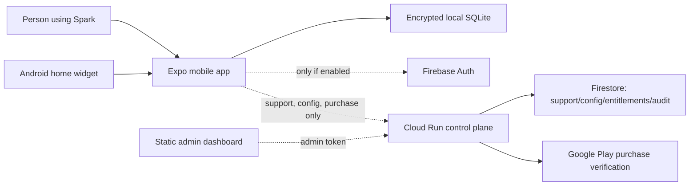

# Architecture

## System boundary

The solid path is the entire free product. The dotted paths are optional.

## Repository boundaries

| Location | Responsibility |
|---|---|
| `apps/mobile` | UI, device database, local notifications, widget, backup, optional API client |
| `packages/domain` | Pure scheduling, planning, rhythm, and reward rules |
| `packages/cloud-contracts` | Zod schemas shared by mobile, API, and dashboard |
| `services/control-plane` | Authenticated support, purchase verification, grants, config, audit |
| `apps/admin` | Static operator UI; it never talks directly to Firestore |
| `infra/terraform` | Optional GCP/Firebase infrastructure and hard cost-oriented defaults |

## Local data

The mobile database stores:

- habits and three variants
- completion history
- focus sessions
- capture items
- routines and steps
- daily capacity check-ins
- preferences
- a cached entitlement

SQLCipher encrypts the database in native development and store builds. Its randomly generated
key is stored with Expo SecureStore. SQLCipher is not available in Expo Go, so a development
build is required for a production-like test.

Backups are explicit JSON exports. The database is encrypted at rest, but an exported JSON file
is readable. The user chooses its destination.

## Cloud data

Firestore contains only:

- `users`: random ID, optional linked email, app/platform version, last cloud use
- `supportThreads/{id}/messages`: text deliberately submitted to support
- `entitlements`: verified Play, promo, or owner grant
- `promoCodes`: official Play codes imported by an owner
- `config/current`: bounded global app configuration
- `adminAudit`: operator and purchase actions

There are no client Firestore permissions. `firestore.rules` denies all reads and writes; Cloud
Run accesses it through IAM.

## Authentication

The mobile app does not ask for an account during onboarding. When the user first opens support
or checks a purchase, Firebase creates a random anonymous identity and persists it locally.

The dashboard uses Google sign-in. Cloud Run verifies every Firebase ID token and reads an
`adminRole` custom claim. The bootstrap owner allowlist should be temporary.

## Availability behavior

- no network: all core tools work
- API not configured: support and purchase buttons explain why they are unavailable
- config fetch fails: cached or baked defaults are used
- Cloud Run cold start: support may take a few seconds; the habit loop is unaffected
- Firestore unavailable: local data is unaffected

## Security controls

- 128 KB API body limit
- global and support-specific rate limits
- bounded list sizes
- strict CORS for the dashboard
- Firebase token revocation checks
- separate support/content/owner roles
- server-side Play verification and acknowledgement
- audited purchase, grant, promo, support, config, and role changes
- no service-account JSON keys in the repository or mobile app
- Cloud Run service account receives only datastore and Firebase Auth administration roles
